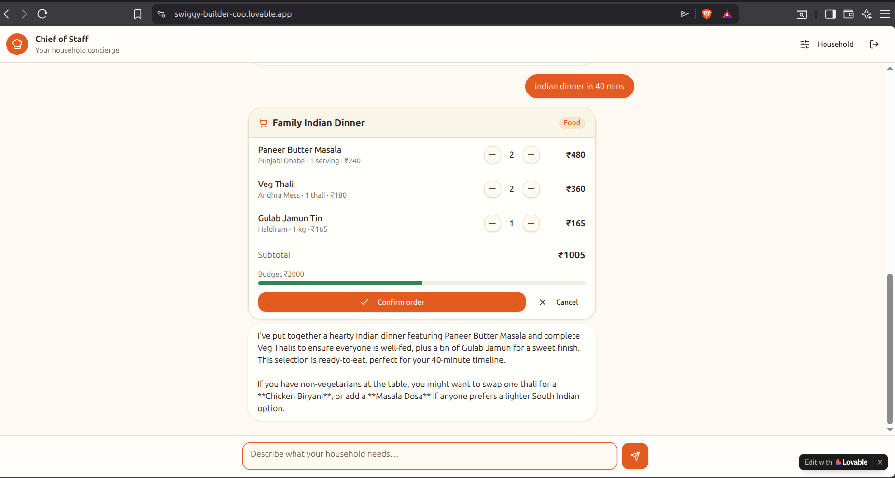

# Indian Household Chief of Staff

An AI-powered household assistant for Indian families.

🔗 Live Demo: https://swiggy-builder-coo.lovable.app/

## Screenshot



Instead of searching for products, restaurants, or groceries, users simply describe a real-world situation:

* "My child has a fever"
* "Guests are arriving in 30 minutes"
* "We need groceries for the weekend"
* "Family movie night"

The assistant interprets the situation, considers household preferences such as dietary restrictions, preferred brands, and budget constraints, and prepares a recommended order for review. Users remain in control through a confirmation-first workflow before any action is executed.

---

## Problem

Modern Indian families spend significant time coordinating routine household tasks:

* Ordering food for guests
* Managing groceries
* Planning family meals
* Handling urgent situations

These tasks often require switching between multiple apps, searching through catalogs, and manually building carts.

Chief of Staff aims to reduce household coordination to a single message.

---

## MVP Features

### Household Profile

Store family-specific preferences including:

* Dietary preferences
* Preferred brands
* Household budget
* Family members

These preferences are used to personalize recommendations.

### Conversational Interface

Users interact with the system through a chat-based interface and describe situations in natural language.

Example:

```text
Guests arriving in 40 minutes. Order Indian food.
```

### AI Recommendation Engine

The assistant:

* Understands intent
* Considers household preferences
* Generates a draft order
* Suggests alternatives
* Explains its reasoning

### Confirm-First Workflow

The assistant never executes purchases automatically.

Workflow:

```text
Situation
  ↓
Recommendation
  ↓
Draft Cart
  ↓
User Approval
  ↓
Execution
```

This ensures users retain full control over spending and ordering decisions.

### Budget Awareness

Recommendations are generated within household budget constraints and presented with clear cost visibility.

---

## Example

### User

```text
Guests arriving in 40 minutes. Order Indian food.
```

### Assistant

Draft Order:

* Paneer Butter Masala × 2
* Veg Thali × 2
* Gulab Jamun × 1

Total: ₹1005

Budget: ₹2000

The user can:

* Confirm
* Edit
* Cancel

before any action is taken.

---

## Architecture

```text
User
  ↓
Chat UI
  ↓
AI Agent
  ↓
Household Profile
  ↓
Draft Cart Generator
  ↓
Pending Action Store
  ↓
Confirm / Edit Workflow
```

Future versions will integrate Swiggy Builders MCP for real product discovery and order placement.

---

## Technology Stack

### Frontend

* TanStack Start
* React 19
* TypeScript
* Tailwind CSS

### AI

* Vercel AI SDK
* Lovable AI Gateway
* Gemini Flash

### Backend

* Lovable Cloud
* Supabase
* Row Level Security (RLS)

### Authentication

* Email/Password
* Google Login

### Future Integrations

* Swiggy Builders MCP
* Instamart
* Food
* Dineout

---

## Security Principles

### User Approval Required

No orders are placed automatically.

### Budget Enforcement

Recommendations must remain within household-configured limits.

### Data Minimization

Only information necessary for personalization is stored:

* Dietary preferences
* Preferred brands
* Budget settings

No sensitive family information is required.

---

## Roadmap

### V1 (Current MVP)

* Household profile
* Conversational UI
* AI recommendations
* Draft carts
* Confirm/Edit workflow
* Budget-aware suggestions

### V2

* Swiggy OAuth integration
* Swiggy MCP connectivity
* Real-time product discovery
* Restaurant recommendations
* Order placement after approval

### V3

* Household memory enrichment
* Recurring purchase detection
* Smart grocery replenishment
* Family-specific recommendations

---

## Vision

Chief of Staff is designed as a household operations copilot for Indian families.

The long-term goal is to transform everyday household situations into actionable plans through a single conversational interface, reducing the effort required to coordinate food, groceries, dining, and family logistics.
